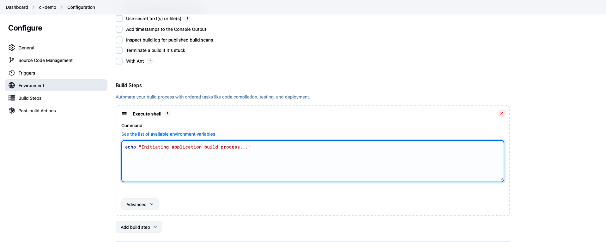

# Jenkins Integration: Complete Simple CI/CD Pipeline Implementation

Get ready to dive into a hands-on tutorial that walks you through setting up a simple CI pipeline using Jenkins. The following tutorial establishes footprints to build  integration workflows that mirror enterprise-level practices.

## What You’ll Learn
  
- Setting up Jenkins, installing plugins
- Configuring Jenkins for Git integration and pipeline features  
- Running your first automated build and deployment  
- Troubleshooting common setup hiccups  
- Quick reference for ports, plugins, and logs

## Jenkins Login

One you have completed the steps in the README.md file and jenkins container is running, Access the Jenkins interface at `http://localhost:8080`.


Input the admin password into the Jenkins setup interface to proceed with configuration.


## Plugin Installation

Jenkins requires specific plugins for Git integration and pipeline functionality:

- **Git Plugin**: Enables repository connectivity
- **Pipeline Plugin**: Supports pipeline-as-code workflows  
- **Docker Pipeline Plugin**: Facilitates container integration (optional)

Complete the plugin installation and create an administrative user account.

## Project Configuration

Create a new Freestyle project with the following specifications:

1. Navigate to "New Item" in the Jenkins dashboard
2. Enter project name: `ci-demo`
3. Select "Freestyle project" template
4. Configure Source Code Management with Git
5. Specify your GitHub repository URL
6. Change branch to `*/main`




## Build Step Configuration

Add an execution shell build step with basic commands:

```bash
echo "Initiating application build process..."
```

**[Image Placeholder]**: *Suggest: Jenkins project configuration screen showing the build steps section with shell command input field*

### Webhook Integration (Optional)

For automated build triggers, configure GitHub webhooks:

1. Access GitHub repository settings
2. Navigate to Webhooks section
3. Set payload URL: `http://:8080/github-webhook/`
4. Configure content type as `application/json`

## Pipeline Testing

Validate the implementation by pushing code to your GitHub repository. Jenkins should automatically detect the change and execute the build process.


## Troubleshooting Common Issues

When things don’t go as planned, here’s a quick checklist I wish I’d had:

| Problem                    | Resolution                                                  |
|----------------------------|-------------------------------------------------------------|
| Port 8080 occupied         | Change `ports` mapping in your `docker-compose.yml`         |
| Repository cloning failure | Check repo URL and access rights; configure SSH keys or tokens |
| Jenkins won’t start        | Run `docker logs jenkins-ci` to inspect error messages      |

## Quick Reference

| Task                       | Command / Location                                        |
|----------------------------|-----------------------------------------------------------|
| Start containers           | `docker-compose up -d`                                    |
| View Jenkins logs          | `docker logs jenkins-ci`                                  |
| Access Jenkins UI          | http://localhost:8080                                     |
| Install plugins            | Jenkins → Manage Jenkins → Manage Plugins                 |

## What’s Next?

Now that you’ve built a basic CI/CD pipeline:

- Explore **pipeline as code** with shared libraries  
- Add automated **testing stages** (unit, integration)  
- Integrate notifications (Slack, email)  
- Scale with Jenkins agents for parallel builds  
