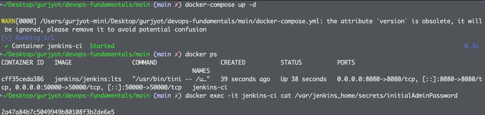

# DevOps Fundamentals and Getting Started with CI/CD Pipeline Implementation

Modern software development requires seamless integration between development and operations teams to deliver high-quality applications efficiently. This guide explores DevOps principles and demonstrates practical CI/CD pipeline implementation using industry-standard tools.

## What You'll Learn

- Core DevOps principles and their business impact
- DevOps lifecycle phases and tool integration
- Practical CI/CD pipeline implementation with Jenkins and Docker
- Industry best practices for automated deployment workflows

## Understanding DevOps: Beyond the Buzzword

DevOps represents a cultural and technical transformation that bridges the traditional gap between software development and IT operations. This methodology emphasizes **collaboration**, **automation**, and **continuous improvement** as fundamental pillars for modern software delivery.

**[Image Placeholder]**: *Suggest: DevOps culture transformation diagram showing the evolution from siloed teams to collaborative cross-functional units with shared responsibilities*

The core philosophy transforms isolated departmental structures into unified, cross-functional teams that share responsibility for the entire software lifecycle. This paradigm shift eliminates traditional bottlenecks and accelerates delivery cycles while maintaining system reliability.

## DevOps Lifecycle Architecture

The DevOps workflow operates as a continuous cycle encompassing eight interconnected phases: **Plan**, **Develop**, **Build**, **Test**, **Release**, **Deploy**, **Operate**, and **Monitor**. Each phase seamlessly transitions into the next, creating an infinite loop of improvement and delivery.

**[Image Placeholder]**: *Suggest: Circular DevOps lifecycle diagram with arrows showing the continuous flow between Plan → Develop → Build → Test → Release → Deploy → Operate → Monitor → Plan*

### Tool Ecosystem Integration

Each lifecycle phase leverages specialized tools optimized for specific functions:

| Phase | Primary Tools | Function |
|-------|---------------|----------|
| **Plan** | Jira, Git | Project management and version control |
| **Build/Test** | Jenkins, Bamboo, Maven | Continuous integration and testing |
| **Deploy** | Docker, Kubernetes, Helm | Container orchestration and deployment |
| **Monitor** | Prometheus, Grafana | Performance monitoring and observability |

## Traditional IT vs DevOps: A Comparative Analysis

The transformation from traditional IT practices to DevOps methodology represents a fundamental shift in organizational approach:

| Characteristic | Traditional IT | DevOps Implementation |
|----------------|----------------|----------------------|
| **Team Structure** | Departmental silos | Cross-functional collaboration |
| **Delivery Process** | Manual, sequential | Automated, parallel |
| **Failure Management** | Reactive, concealed | Proactive, transparent |
| **Tool Integration** | Isolated, manual processes | Unified CI/CD pipelines |

This transformation significantly reduces deployment risks, accelerates time-to-market, and improves system reliability through automated testing and monitoring.

## Production Workflow Example

Consider a modern DevOps implementation: A developer commits Python code to GitHub, which automatically triggers Jenkins to initiate the build process. Docker containerizes the application, Kubernetes orchestrates the deployment, MLflow tracks model performance metrics, and Prometheus provides real-time monitoring across the entire infrastructure.

**[Image Placeholder]**: *Suggest: End-to-end workflow diagram showing code commit → Jenkins trigger → Docker build → Kubernetes deployment → MLflow tracking → Prometheus monitoring with connecting arrows and tool logos*

This automated workflow eliminates manual intervention, reduces human error, and ensures consistent deployment practices across environments.

## Essential DevOps Toolchain for 2025

Professional DevOps implementations rely on a curated set of tools, each optimized for specific operational requirements:

| Function Category | Recommended Tools | Purpose |
|-------------------|------------------|---------|
| **CI/CD Automation** | Jenkins, GitHub Actions, GitLab | Build and deployment orchestration |
| **Containerization** | Docker | Application packaging and isolation |
| **Container Orchestration** | Kubernetes | Production-scale container management |
| **Infrastructure as Code** | Terraform | Declarative infrastructure provisioning |
| **Monitoring & Observability** | Prometheus, Grafana, ELK  | System metrics and visualization |
| **Source Code Management** | Bitbucket, Git | Version control and collaboration |

## Career Opportunities in DevOps

The DevOps field presents significant professional opportunities with high market demand across industries. Primary career paths include **DevOps Engineer**, **Platform Engineer**, and **Site Reliability Engineer (SRE)** roles, each offering competitive compensation packages and substantial career growth potential.

**[Image Placeholder]**: *Suggest: Career progression chart showing entry-level to senior DevOps roles with salary ranges and required skills for each level*

Organizations increasingly prioritize DevOps expertise as digital transformation initiatives expand, creating sustained demand for qualified professionals.

## Practical Implementation: Jenkins CI/CD Pipeline with Docker Compose

This section demonstrates hands-on implementation of a production-ready CI/CD pipeline using Jenkins and Docker Compose. The following tutorial establishes automated build and deployment workflows that mirror enterprise-level practices.

### System Requirements

Before beginning implementation, ensure your development environment includes:

- Docker and Docker Compose installation
- GitHub account with repository access
- Sample application repository (Python or Node.js recommended)

### Jenkins Container Configuration

Create a `docker-compose.yml` file with the following specification:

```yaml
version: '3.8'

services:
  jenkins:
    image: jenkins/jenkins:lts
    container_name: jenkins-ci
    ports:
      - "8080:8080"
      - "50000:50000"
    volumes:
      - jenkins_home:/var/jenkins_home
    restart: unless-stopped

volumes:
  jenkins_home:
```

### Service Initialization

Launch the Jenkins service using Docker Compose:

```bash
docker-compose up -d
```

Access the Jenkins interface at `http://localhost:8080` once the container is operational.


### Authentication Setup

Retrieve the administrative password from the container:

```bash
docker exec -it jenkins-ci cat /var/jenkins_home/secrets/initialAdminPassword
```

Input this password into the Jenkins setup interface to proceed with configuration.



### Plugin Installation

Jenkins requires specific plugins for Git integration and pipeline functionality:

- **Git Plugin**: Enables repository connectivity
- **Pipeline Plugin**: Supports pipeline-as-code workflows  
- **Docker Pipeline Plugin**: Facilitates container integration (optional)

Complete the plugin installation and create an administrative user account.

### Project Configuration

Create a new Freestyle project with the following specifications:

1. Navigate to "New Item" in the Jenkins dashboard
2. Enter project name: `ci-demo`
3. Select "Freestyle project" template
4. Configure Source Code Management with Git
5. Specify your GitHub repository URL
6. Change branch to `*/main`


### Build Step Configuration

Add an execution shell build step with basic commands:

```bash
echo "Initiating application build process..."
```

**[Image Placeholder]**: *Suggest: Jenkins project configuration screen showing the build steps section with shell command input field*

### Webhook Integration (Optional)

For automated build triggers, configure GitHub webhooks:

1. Access GitHub repository settings
2. Navigate to Webhooks section
3. Set payload URL: `http://:8080/github-webhook/`
4. Configure content type as `application/json`

### Pipeline Testing

Validate the implementation by pushing code to your GitHub repository. Jenkins should automatically detect the change and execute the build process.


## Troubleshooting Common Issues

| Problem | Resolution |
|---------|-----------|
| **Port 8080 occupied** | Modify port mapping in `docker-compose.yml` |
| **Repository cloning failure** | Verify repository accessibility or configure authentication |
| **Jenkins startup issues** | Execute `docker logs jenkins-ci` for diagnostic information |

## What's Next?

The next phase of implementation will integrate Docker image building and container registry management into the Jenkins pipeline, creating a complete containerized deployment workflow for modern application delivery and deploying 
